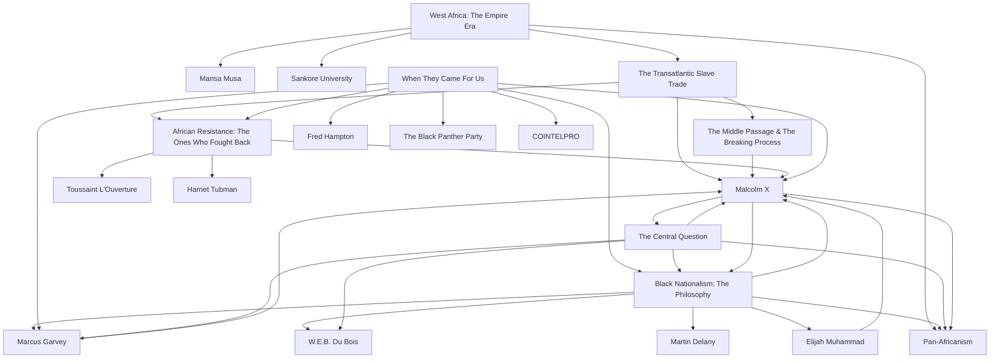

# ✊🏿 Black Nationalism & African Heritage — A Living Knowledge Base

> *"A people without the knowledge of their past history, origin and culture is like a tree without roots."* — Marcus Garvey

---

## What This Is

This is my personal knowledge base on black nationalism, African heritage, and black excellence — built note by note as I go deeper into the history, philosophy, and thinkers that shaped the black experience.

This isn't a textbook. It's a living document — raw, honest, and built on the principle that full truth only, no propaganda in either direction.

Every note in here I have read, studied, and been tested on before it was written. Nothing goes in until I understand it.

---

## Who I Am

I'm **Bari** — a student of this history, currently reading *The Autobiography of Malcolm X* and building this vault alongside it. I started this because I realized most of what I thought I knew about black history was surface level at best and deliberately distorted at worst.

This is me doing the work to fix that.

---

## What's Inside

| Note | What It Covers |
|------|----------------|
| [West Africa — The Empire Era](west_africa_the_empire_era.md) | Ghana, Mali, Songhai, Mansa Musa, Timbuktu — what existed before colonization |
| [The Transatlantic Slave Trade](the_transatlantic_slave_trade.md) | How it worked, the numbers, African complicity, what it destroyed |
| [The Middle Passage & The Breaking Process](the_middle_passage_and_the_breaking_process.md) | The ocean crossing, tight packing, the systematic destruction of identity |
| [African Resistance — The Ones Who Fought Back](african_resistance_the_ones_who_fought_back.md) | 400+ ship revolts, Haiti, Nat Turner, Harriet Tubman — the resistance that gets erased |
| [Black Nationalism — The Philosophy](black_nationalism_the_philosophy.md) | The actual ideology, key thinkers, Garvey vs Du Bois, the central tensions |
| [When They Came For Us](when_they_came_for_us_black_excellence_destroyed_by_the_system.md) | Black Wall Street, Reconstruction, Fred Hampton, the UNIA, the Panthers — the documented pattern of suppression |
| [The Central Question](the_central_question_build_within_or_outside_the_system.md) | My developing political thought — build within or outside the system? |

---

## The Principles Behind This Vault

- **Full truth only** — where black civilization was great, we say so with evidence. Where the history is complex or uncomfortable, we don't look away.
- **Primary thinkers, not summaries** — Garvey, Du Bois, Malcolm X, Fanon, Nkrumah in their own words and ideas, not watered down versions.
- **Connected knowledge** — every note links to related notes. Nothing exists in isolation. The graph view in Obsidian shows how it all connects.
- **Living document** — this vault grows as I grow. Notes get updated as my understanding deepens.

---

## The Reading Order

If you're new here, this is the order that makes the most sense:

1. West Africa — The Empire Era
2. The Transatlantic Slave Trade
3. The Middle Passage & The Breaking Process
4. African Resistance — The Ones Who Fought Back
5. Black Nationalism — The Philosophy
6. When They Came For Us
7. The Central Question

---

## Knowledge Graph

How everything in this vault connects — built from the links inside each note.

---

## Built With

- [Obsidian](https://obsidian.md) — note taking and knowledge graph
- Primary sources, academic historians, and documented facts
- No shortcuts. No propaganda.

---

> *This vault is dedicated to everyone who built something and had it taken. We remember.*

— Bari
